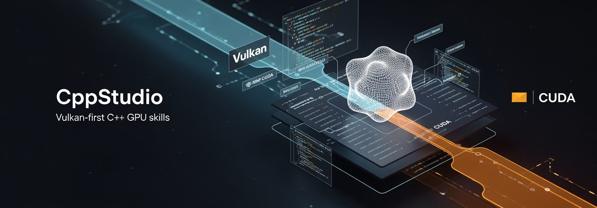
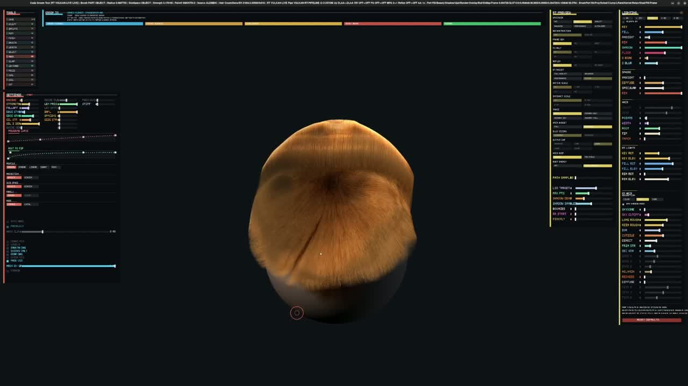

# CppStudio

[](https://github.com/tarkansarim/CppStudio/actions/workflows/validate.yml)

CppStudio is an agentic ChatGPT Codex skills package for native C++ GPU engineering. It gives Codex
a reusable Vulkan-first C++/CUDA project backbone, lane discipline, validation hooks, and a curated
donor-reference library for 3D, rendering, simulation, AI runtimes, CUDA, and Vulkan work. It also
includes optional code-map support for projects that need durable architecture context across future
agent sessions.

The goal is to make Codex less dependent on broad model memory when it enters specialized native GPU
work. Instead of filling gaps from stale or incomplete training examples, agents get maintained
repo-local guidance, known-good project structure, donor references, caveats, and validation lanes so
their plans and code are more precise, reproducible, and easier to audit.

Use it when you want Codex to create, audit, or upgrade native C++ GPU projects without turning every
new repo into a one-off build-system and donor-research exercise.

CppStudio focuses on:

- A Vulkan-first native C++ GPU project backbone with optional CUDA and combined CUDA/Vulkan lanes.
- A nested donor-reference library that routes agents to relevant 3D, AI, simulation, rendering,
  CUDA, Vulkan, and infrastructure references without loading the whole library into context.
- Validation, profiling, rollout, and optional project-memory workflows that keep agent output
  auditable.

## Sample Projects Built With This Workflow

These are examples of native GPU projects built with this kind of CppStudio agent workflow: scoped
skills, maintained project maps, donor-guided implementation, and validation-heavy iteration.

### CUDA Groom Tool

[](https://tarkansarim.github.io/CppStudio/assets/videos/cuda-groom-tool.mp4)

[Watch the CUDA Groom Tool sample video](https://tarkansarim.github.io/CppStudio/assets/videos/cuda-groom-tool.mp4).

Realtime C++/CUDA hair grooming with CUDA strand editing kernels, a live 3D viewport, Maya-style
camera controls, and a production-shaped brush set for combing, screen-space grooming, puffing,
pinching, smoothing, length work, selection masking, parting, clumping, frizz, randomization, and
cutting. The project grew into a sophisticated realtime hair lab: shell-aware sparse voxel envelopes
for volume-aware grooming, soft selection-aware edits, deferred/asynchronous smooth guide rebuilds,
CUDA density-grid shadow tracing, scalp receiver shadows, persistent viewport UI settings, scripted
viewport smoke tests, and an RTX-oriented render track covering ray tracing, Chiang/Far-Field hair
shading, DLSS/RR-style reconstruction lanes, and lookdev/debug controls.

### Wetbrush Paint Simulation

[](https://tarkansarim.github.io/CppStudio/assets/videos/wetbrush-paint-simulation.mp4)

[Watch the Wetbrush Paint Simulation sample video](https://tarkansarim.github.io/CppStudio/assets/videos/wetbrush-paint-simulation.mp4).

A C++ GPU painting simulation based on the Wetbrush paper, with bristle-level brush dynamics,
grid-based liquid, particle-based liquid, bristle-particle transfer, grid-particle transfer, and a
late-frame rendering path for persistent paint and particle visualization. The project uses a
maintained code map and repo-local skills to keep the paper sections, CUDA kernels, brush/input
timing, particle carrier path, liquid grid, transfer lanes, persistent canvas, playback reports, and
performance evidence connected as the implementation evolves.

## Quick Start

Open this repo in ChatGPT Codex and ask:

```text
Install this CppStudio repo into my ChatGPT Codex home. Use the repo scripts, preserve my existing
AGENTS.md content, and report what changed.
```

Restart Codex after installation, then ask for native C++ GPU work:

```text
Create a Vulkan-first C++ application called RayLab.
```

Expected result: Codex loads `cpp-cuda-vulkan-studio`, keeps the project Vulkan-first unless CUDA is
explicitly needed, scaffolds or upgrades the native C++ project, and opens only the donor references
that match the task.

## Requirements

For installing CppStudio as a Codex skill:

- ChatGPT Codex with local skill support.
- Shell access for the installing agent.
- Git, Python 3.10 or newer, and `rsync` for the normal Linux/macOS/WSL rollout scripts.
- Windows users without Bash/`rsync` can use the manual PowerShell install reference.

CUDA, Vulkan, CMake, and a C++ compiler are not required just to install the skill. Install those
only on machines that should build or validate generated native GPU projects.

## Install

CppStudio is meant to be installed by your coding agent. If your agent has shell access to the
machine, ask it:

```text
Install this CppStudio repo into my ChatGPT Codex home. Use the repo scripts, preserve my existing
AGENTS.md content, and report what changed.
```

The normal agent command is:

```bash
cd /path/to/CppStudio
./scripts/rollout_to_codex.sh
```

That installs the main skill and donor-library links into the Codex home on the machine where the
command runs. The default Codex home is `${HOME}/.codex`. Restart Codex after installation so changed
skill metadata is discovered.

For a non-default Codex home, pass `SYNC_CODEX_HOME` to the rollout script:

```bash
cd /path/to/CppStudio
SYNC_CODEX_HOME=/path/to/.codex ./scripts/rollout_to_codex.sh
```

The rollout and sync scripts use `SYNC_CODEX_HOME`, not `CODEX_HOME`, so nested agent sessions do not
accidentally install into an isolated session home.

You do not need CUDA, Vulkan, CMake, or a compiler just to install CppStudio into Codex. Install GPU
toolchains only when you want this machine to build or validate generated C++ GPU projects.

## What Gets Installed

- Main skill:
  `${HOME}/.codex/skills/cpp-cuda-vulkan-studio`
- Optional companion donor links for installed companion skills such as `cuda-kernel-authoring`,
  `vulkan-compute-sync`, and `modern-cpp-cmake`
- Optional tiny user-level `AGENTS.md` relay that tells agents to load `cpp-cuda-vulkan-studio` for
  native C++ GPU, realtime rendering/visualization, C++ GPU code-map, Vulkan, CUDA, or mixed
  CUDA/Vulkan work

Existing user content is preserved. CppStudio scripts only replace content inside their own marked
blocks:

- `<!-- cppstudio-user-agents-relay:begin -->` through
  `<!-- cppstudio-user-agents-relay:end -->`
- `<!-- cppstudio-donor-library:begin -->` through
  `<!-- cppstudio-donor-library:end -->`

## Use It

After installation and a Codex restart, you usually do not need to name the skill. Ask Codex for
native C++ GPU, Vulkan, CUDA, renderer, realtime 3D, simulation, or donor-reference work, and Codex
should load `cpp-cuda-vulkan-studio` automatically.

```text
Create a Vulkan-first C++ application called RayLab.
```

```text
Upgrade this C++ renderer repo with the CppStudio backbone; use Vulkan by default unless CUDA is explicitly needed.
```

```text
Find suitable donors for a real-time grooming and fur simulation tool, then wire the selected
patterns into this C++/Vulkan project.
```

Mention `$cpp-cuda-vulkan-studio` explicitly only when automatic skill routing is unavailable or did
not trigger.

## What The Skill Does

- Prefer Vulkan for unspecified native C++ GPU, rendering, realtime, XR, simulation-visualization, or
  cross-platform work.
- Keep CUDA explicit and separate unless the user chooses CUDA, requirements force CUDA, or a
  deliberate combined CUDA/Vulkan or real interop lane is needed.
- Scaffold or upgrade C++ app+library repos with CMake presets, CTest labels, shader tooling,
  optional CUDA lanes, validation scripts, and self-hosted GPU CI hooks.
- Route agents through nested donor references for graphics, glTF/runtime assets, WebGPU/WebGL,
  renderer backbones, path tracing, engine architecture, mesh pipelines, asset IO, NURBS, materials,
  CAD, BIM/IFC, terrain/geospatial data, AI runtimes, neural 3D, Gaussian splatting, grooming/fur,
  DCC scene pipelines, volumes, medical/scientific data, animation, muscle/flesh simulation, VFX,
  particles, simulation, XR, and native engineering infrastructure.
- Offer an optional code map for larger generated or upgraded C++ GPU projects that need durable
  architecture context across future agent sessions.
- Coordinate companion skills for CMake, Vulkan synchronization, CUDA kernels, and verification.

## Optional Code Maps

CppStudio can add a maintained code map to a target native C++ GPU project, but it is optional and
per project. The benefit is practical project memory: future agents can find subsystem ownership,
backend boundaries, build and test lanes, validation entrypoints, and donor decisions without
rereading the entire repo from scratch.

When a map is enabled, agents use it as the first navigation step before code changes: the
architecture index and manifest point them to the matching subsystem doc and primary paths for the
work.

There is no standalone CppStudio code-map skill. The workflow lives inside `cpp-cuda-vulkan-studio`
so the map follows the same Vulkan/CUDA lane policy, validation rules, and donor-routing context as
the project it describes.

For an existing project, ask for a maintained CppStudio code map in the same native C++ GPU context:

```text
Create a maintained CppStudio code map for this existing C++/Vulkan renderer repo.
```

The agent should audit the existing layout first, then ask whether to restructure first, preserve the
current layout and document it, or decline code-map enablement. For a new project, an explicit
code-map request counts as acceptance after scaffolding:

```text
Create a Vulkan-first C++ application called RayLab and make sure future agents have a code map.
```

Support files may exist before a map is enabled, but agents should maintain and load the map only
when `.cppstudio/code-map-state.json` says `enabled`.

## Skills And Donors Included

### Bundled Skills

- `cpp-cuda-vulkan-studio`: installed user-level skill for Vulkan-first C++ GPU, CUDA, combined
  CUDA/Vulkan builds, explicit interop work, project scaffolding, validation lanes, and donor routing.
- `cppstudio-repo-onboarding`: repo-local onboarding skill for agents editing this CppStudio repo.
  It is not the public user-level C++ GPU skill.

### Companion Skill Links

CppStudio can add donor-library links to these companion skills when they are already installed:

- `modern-cpp-cmake`: CMake, target layout, presets, tests, and native C++ project hygiene.
- `vulkan-compute-sync`: Vulkan compute/render setup, descriptors, barriers, synchronization, and
  frame lifetime.
- `cuda-kernel-authoring`: CUDA kernels, launch wrappers, numerical tests, and Compute Sanitizer
  planning.

### Donor Index Files

The donor library is a reference map, not a vendored source tree. Agents use it to choose
architecture patterns, APIs, tests, algorithms, and dependency candidates.

The routing is intentionally nested so the first loaded skill text stays small:

- The donor library entrypoint gives policy and category choices.
- Production overlays translate VFX studio, game studio, and native infrastructure vocabulary into
  technical donor categories.
- The agent lookup guide maps broad prompts to the right category files.
- Category files contain compact donor maps for one domain.
- Deep profiles are loaded only after a category is selected.

Start from these files:

- [Donor library entrypoint](skills/cpp-cuda-vulkan-studio/references/donor-library/README.md)
- [Selection policy](skills/cpp-cuda-vulkan-studio/references/donor-library/selection-policy.md)
- [Production overlays](skills/cpp-cuda-vulkan-studio/references/donor-library/production/README.md)
- [Agent lookup guide](skills/cpp-cuda-vulkan-studio/references/donor-library/agent-lookup.md)
- [Deep profile index](skills/cpp-cuda-vulkan-studio/references/donor-library/profiles/README.md)

### Production Routing Overlays

- [VFX studio](skills/cpp-cuda-vulkan-studio/references/donor-library/production/vfx-studio.md):
  modeling, texturing, rigging, creature FX, look development, lighting, and FX.
- [Games](skills/cpp-cuda-vulkan-studio/references/donor-library/production/games.md): character art,
  world art, technical art, gameplay animation, realtime VFX, rendering, tools, physics, and XR games.
- [Native engineering infrastructure](skills/cpp-cuda-vulkan-studio/references/donor-library/production/native-engineering-infrastructure.md):
  project templates, CMake/build layout, testing, validation, profiling, CI, dependency policy, and
  template update safety.

### Donor Category Files

3D, graphics, simulation, and XR category files:

- [Animation and rigging](skills/cpp-cuda-vulkan-studio/references/donor-library/animation-rigging.md)
- [Assets, meshes, materials, and NURBS](skills/cpp-cuda-vulkan-studio/references/donor-library/assets-meshes-materials.md)
- [BIM, AEC, and IFC](skills/cpp-cuda-vulkan-studio/references/donor-library/bim-aec-ifc.md)
- [CAD and precision geometry](skills/cpp-cuda-vulkan-studio/references/donor-library/cad-precision-geometry.md)
- [DCC scene pipelines](skills/cpp-cuda-vulkan-studio/references/donor-library/dcc-scene-pipeline.md)
- [Geometry and simulation](skills/cpp-cuda-vulkan-studio/references/donor-library/geometry-simulation.md)
- [glTF runtime assets](skills/cpp-cuda-vulkan-studio/references/donor-library/gltf-runtime-assets.md)
- [Graphics and rendering](skills/cpp-cuda-vulkan-studio/references/donor-library/graphics-rendering.md)
- [Hair, grooming, and fur](skills/cpp-cuda-vulkan-studio/references/donor-library/hair-grooming-fur.md)
- [Medical and scientific volumes](skills/cpp-cuda-vulkan-studio/references/donor-library/medical-scientific-volumes.md)
- [Muscle, flesh, and biomechanics](skills/cpp-cuda-vulkan-studio/references/donor-library/muscle-flesh-biomechanics.md)
- [Neural 3D](skills/cpp-cuda-vulkan-studio/references/donor-library/neural-3d.md)
- [GPU simulation](skills/cpp-cuda-vulkan-studio/references/donor-library/simulation-gpu.md)
- [Surfaces and subdivision](skills/cpp-cuda-vulkan-studio/references/donor-library/surfaces-subdivision.md)
- [Terrain, geospatial, and 3D Tiles](skills/cpp-cuda-vulkan-studio/references/donor-library/terrain-geospatial.md)
- [Texture, material, and color](skills/cpp-cuda-vulkan-studio/references/donor-library/texture-material-color.md)
- [Realtime VFX and particles](skills/cpp-cuda-vulkan-studio/references/donor-library/vfx-particles.md)
- [Volumes and voxels](skills/cpp-cuda-vulkan-studio/references/donor-library/volumes-voxels.md)
- [Vulkan foundation tooling](skills/cpp-cuda-vulkan-studio/references/donor-library/vulkan-foundation-tooling.md)
- [XR and spatial computing](skills/cpp-cuda-vulkan-studio/references/donor-library/xr-spatial.md)

Other GPU, AI, and ML category files:

- [AI runtimes and kernels](skills/cpp-cuda-vulkan-studio/references/donor-library/ai-runtimes-kernels.md)

Native project infrastructure category files:

- [Native engineering infrastructure](skills/cpp-cuda-vulkan-studio/references/donor-library/native-engineering-infrastructure.md)

### Donor Profile Caveats

Some donors are direct C/C++ implementation references, some are dependency-scale references, and
some are explicitly reference-only or study-only. Study-only donors are concept references, not code
donors. Browser, Python, notebook, DCC, service, JIT/DSL, or non-C++ donors can still guide
algorithms, behavior, tests, UX, and architecture, but agents should port the idea through the active
C++/Vulkan/CUDA lane instead of copying code directly unless the user explicitly chooses that runtime
and license shape.

Inline identifiers:

- `reference-only`: not a direct native C++ donor for this package. Use behavior, algorithms,
  architecture, tests, fixtures, or outputs as guidance, then port intentionally through the active
  C++/Vulkan/CUDA lane.
- `mixed-native`: contains useful native C/C++/CUDA pieces, but the surrounding repo is shaped by
  Python, PyTorch, service, web, generated-code, or other non-C++ runtime surfaces. Inspect and isolate
  native subtrees before using it as an implementation donor.
- `study-only`: concept or workflow reference only. Do not copy code into generated projects or reusable
  skills without explicit approval and license review.

Unmarked entries are still not automatic copy/paste sources; always read the linked profile first.

### Deep Donor Profiles

The full donor-profile inventory lives in the
[deep profile index](skills/cpp-cuda-vulkan-studio/references/donor-library/profiles/README.md).
Those files are intentionally not first-load material. Agents should start from the category files
above, then open only the profile or bundle profile that matches the active task.

The deep profiles cover:

- Vulkan foundations, shader tooling, ray tracing, denoising, reconstruction, and frame/debug
  patterns.
- Rendering engines, path tracers, BVH libraries, WebGPU/WebGL references, and engine architecture.
- Asset, mesh, material, texture, NURBS, DCC, CAD, BIM/IFC, terrain, and geospatial pipelines.
- Neural 3D, Gaussian splatting, grooming/fur, volumes, medical/scientific visualization, animation,
  muscle/flesh simulation, physics, fluids, smoke, fire, VFX, particles, XR, and spatial input.
- CUDA kernels, AI runtimes, ML compilers, inference engines, and native GPU compute references.
- Native C++ project infrastructure, template update safety, CMake/build layout, testing, validation,
  profiling, CI, and dependency management.

Profile caveat identifiers such as `reference-only`, `mixed-native`, and `study-only` are repeated in
the profile index and individual profile files so agents know whether a donor is suitable for direct
C/C++ use or only as behavior, architecture, or algorithmic reference.

### Donor Maintenance

The donor library is curated guidance, not vendored source code. Refresh donor profiles when upstream
SDKs, toolchains, licenses, or major repo structures change, and update researched-date notes when a
meaningful review happens. Donor refreshes should keep the same classification discipline: direct
native donors, dependency candidates, mixed-native references, reference-only material, and study-only
concept sources must stay clearly separated.

## When To Install GPU Tools

Install extra host tools only for lanes you want to build or validate on the current machine:

| Need | Install |
|------|---------|
| Use CppStudio as a Codex skill | Nothing beyond the install command above |
| Validate generated C++ projects locally | CMake, Ninja or another build tool, and a C++ compiler |
| Work on Vulkan projects locally | Vulkan SDK tools such as `glslc`, `spirv-val`, `vulkaninfo`, and validation layers |
| Work on CUDA projects locally | NVIDIA driver, CUDA Toolkit, `nvcc`, and Compute Sanitizer |
| Run optional quality/profiling lanes | `clang-format`, `clang-tidy`, RenderDoc, Nsight tools, or platform-specific profilers |

Detailed setup commands live in [docs/host-toolchain-setup.md](docs/host-toolchain-setup.md).

## Repository Layout

- `skills/cpp-cuda-vulkan-studio/`: source of truth for the user-level Codex skill
- `skills/cpp-cuda-vulkan-studio/assets/app-library-template/`: generated-project template
- `skills/cpp-cuda-vulkan-studio/references/`: project archetypes and donor-reference guidance
- `.cppstudio/` and `docs/CODEBASE_*`: maintained code map for this CppStudio repo
- `companion-skill-snippets/`: managed donor-link snippets for companion skills and user-level relay
- `research/`: source research and trigger-test notes
- `scripts/`: validation, sync, rollout, and watch helpers
- `.codex/skills/cppstudio-repo-onboarding/`: project-level onboarding skill for agents editing this
  repo

The installed copy at `${HOME}/.codex/skills/cpp-cuda-vulkan-studio` is a deployment target, not the
source of truth. Edit this repo, then have an agent publish with the repo scripts.

## More Docs

- [Manual install reference](docs/manual-install.md): copy steps for agents that cannot run rollout
- [Host toolchain setup](docs/host-toolchain-setup.md): Linux, macOS, and Windows C++/Vulkan/CUDA
  setup notes
- [Optional code maps](#optional-code-maps): opt-in architecture context for larger generated or
  upgraded native C++ GPU projects
- [Maintainer guide](docs/maintainer-guide.md): validation, sync, rollout, generated-project, donor,
  and troubleshooting details for agents editing this repo
- [Contributing](CONTRIBUTING.md): public contribution, donor update, validation, and release notes
- [Changelog](CHANGELOG.md): tracked change history for pushed repo changes
- [Codebase architecture index](docs/CODEBASE_ARCHITECTURE_INDEX.md): maintained map for agents
  editing CppStudio itself
- [Donor library](skills/cpp-cuda-vulkan-studio/references/donor-library/README.md): curated donor
  selection entrypoint

## License

CppStudio is released under [The Unlicense](LICENSE) for unrestricted reuse.
